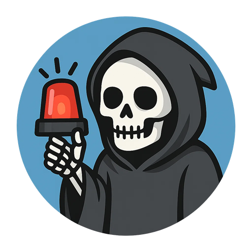

<p align="center">
  
</p>

# Celebrity Death Bot

Celebrity Death Bot is a Cloudflare Worker that runs on a scheduled Cron trigger. It checks the latest Wikipedia page of notable deaths for the current year and notifies subscribed users when a new entry appears.

## How it works

1. **Fetches Wikipedia**: The worker retrieves `https://en.wikipedia.org/wiki/Deaths_in_<year>` where `<year>` is the current year in the America/New_York timezone.
2. **Parses entries**: From the page, it extracts each person's name, Wikipedia path, age, description and cause of death.
3. **Stores in D1**: Entries are stored in a D1 database. Items already in the database are ignored.
4. **LLM evaluation**: Newly discovered entries are sent to Replicate for LLM evaluation. The worker exposes a webhook to receive callbacks from Replicate.
5. **Telegram notifications**: When the callback provides results, the worker sends a message via Telegram to the configured chat IDs.

## Configuration

The worker expects the following bindings and environment variables:

- `DB` – D1 database binding used to persist entries.
- `REPLICATE_API_TOKEN` – API token for Replicate.
- `TELEGRAM_BOT_TOKEN` – Telegram bot token used for sending messages.
- `TELEGRAM_CHAT_IDS` – Comma‑separated list of chat IDs to notify.
- `BASE_URL` – Public URL of the worker, used when building webhook URLs.
- `REPLICATE_WEBHOOK_SECRET` – Optional secret checked on webhook callbacks.
- `MANUAL_RUN_SECRET` – Secret token required to call the manual `/run` endpoint.

## Development

Install dependencies and start the development server using Wrangler:

```bash
npm install
npm run dev
```

Deploy the worker with:

```bash
npm run deploy
```

## Endpoints
- `POST /run` – Manually trigger the job. Requires `MANUAL_RUN_SECRET`.
  - **Auth:** Send the secret in the `Authorization` header:
    ```
    Authorization: Bearer <MANUAL_RUN_SECRET>
    ```
  - **Example (curl):**
    ```bash
    curl -X POST \
      -H "Authorization: Bearer $MANUAL_RUN_SECRET" \
      https://<your-worker>/run
    ```
- `POST /replicate/callback` – Endpoint for Replicate webhook callbacks.
- `GET /health` – Simple health check returning `ok`.

## Telegram Webhook & Commands

Configure your bot to send updates to the Worker and let users manage subscriptions via chat.

- Set the Telegram webhook URL (include a secret if you configured one):
  ```bash
  export BASE_URL=<your-worker-url>
  export TELEGRAM_BOT_TOKEN=<your-token>
  export TELEGRAM_WEBHOOK_SECRET=<your-secret>
  curl -X POST \
    "https://api.telegram.org/bot${TELEGRAM_BOT_TOKEN}/setWebhook" \
    -d url="${BASE_URL}/telegram/webhook?secret=${TELEGRAM_WEBHOOK_SECRET}"
  ```
- Supported commands (send in a DM to your bot):
  - `/start` or `/subscribe` – Subscribe this chat to alerts.
  - `/stop` or `/unsubscribe` – Unsubscribe this chat.
  - `/status` – Show current subscription status.

Notes
- Subscriptions are stored in the D1 table `subscribers` with fields: `type`, `chat_id`, `enabled`, `created_at`.
- Only `type = 'telegram'` is used currently; the schema allows future channels (SMS, Signal, etc.).
- Add secrets via Wrangler: `wrangler secret put TELEGRAM_WEBHOOK_SECRET` and ensure `TELEGRAM_BOT_TOKEN` is set.

## License

This project is licensed under the [MIT License](LICENSE.md).
